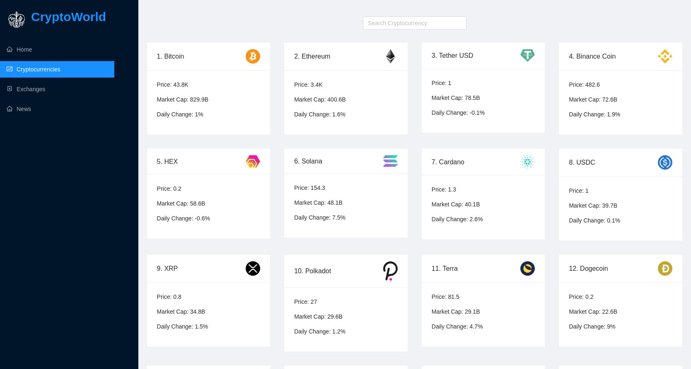
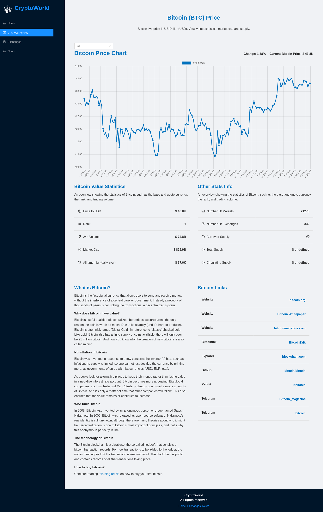

# `CryptoWorld`

CryptoWorld is web application used to track stats and latest news about cryptocurrencies

## `API`

API is used from : https://rapidapi.com/

News API: https://rapidapi.com/microsoft-azure-org-microsoft-cognitive-services/api/bing-news-search1/

Crpyto API: https://rapidapi.com/Coinranking/api/coinranking1/

